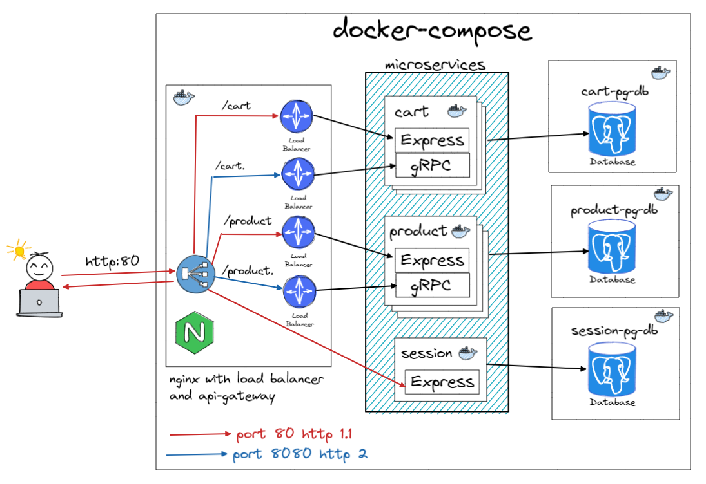

# E-commerce : A microservice approach

Sample e-commerce application based on microservice architecture and built with Typescript, Node.js, Express, gRPC and Nginx, where each folder represents a microservice repo.

## API gateway and load balancer

The application uses Nginx to manage the API gateway and load balancers for the microservices. The idea is to only expose port 80, since it is responsible to redirect the REST API calls to microservices. Port 8080 is used for internal communication between the microservices through gRPC.

## Backend Microservices

### Session

The Session microservices is responsible to handle the user session. Currently, this microservice has only two resources, one to create the session, and another to get a open cart for the session (If the user completes an order, the current cart will be closed, and the user can get another one).

- docs can be found at `localhost:8080/session/docs-api`

### Cart

The Cart microservice implements common cart functionalities like, you can add a product to it, change the product quantity, get a summary with the total, subtotal and discounts.

- docs can be found at `localhost:8080/cart/docs-api`

### Product

The Product microservice consists mainly in the creation of the product and product promotions.

- docs can be found at `localhost:8080/product/docs-api`

## Architecture

The image below illustrate the proposed architecture in this project. It's possible to test the application using the docker-compose in the root of the project, but you should not use it in production, use some docker orchestrator instead like Kubernetes.



## Running Instructions

## Build everything through docker-compose

First create a `.env` file with the required environment variables. You can use the `.env.local` as an example.

```bash
  docker-compose up
```

you can make requests to the endpoint http://localhost:8080.

- session api: http://localhost:8080/session
- cart api: http://localhost:8080/cart
- product api: http://localhost:8080/product

## Build each service separately

First create a `.env` file with the required environment variables. You can use the `.env.local` as an example.

Inside each service folder you can use 

```bash
  docker-compose -f docker-compose.dev.yml up
```

to raise the postgres database container, and 

```bash
  yarn dev
```

to start the application in development mode.